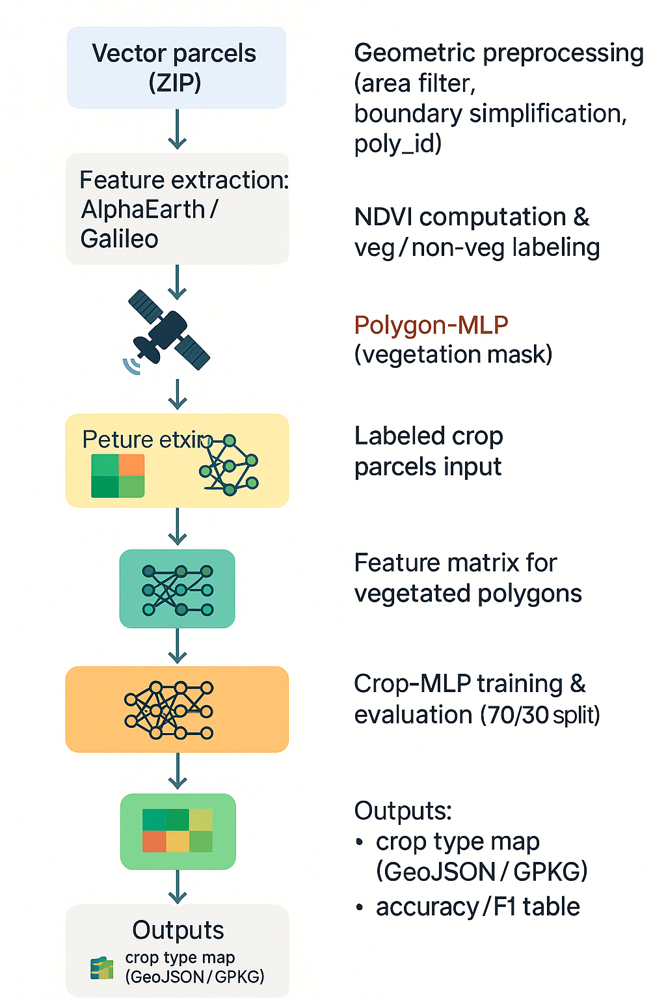
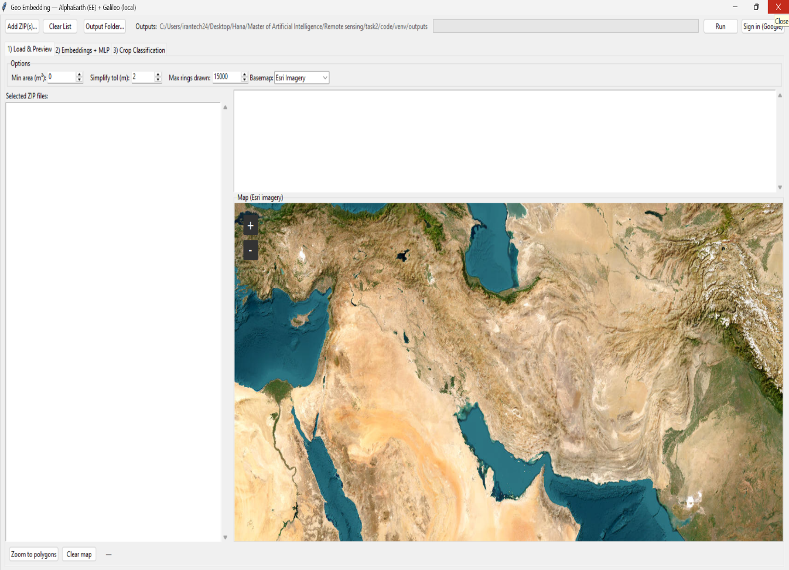
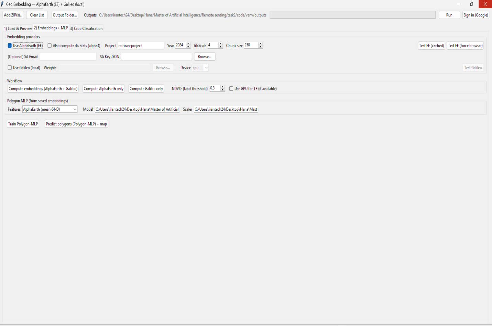
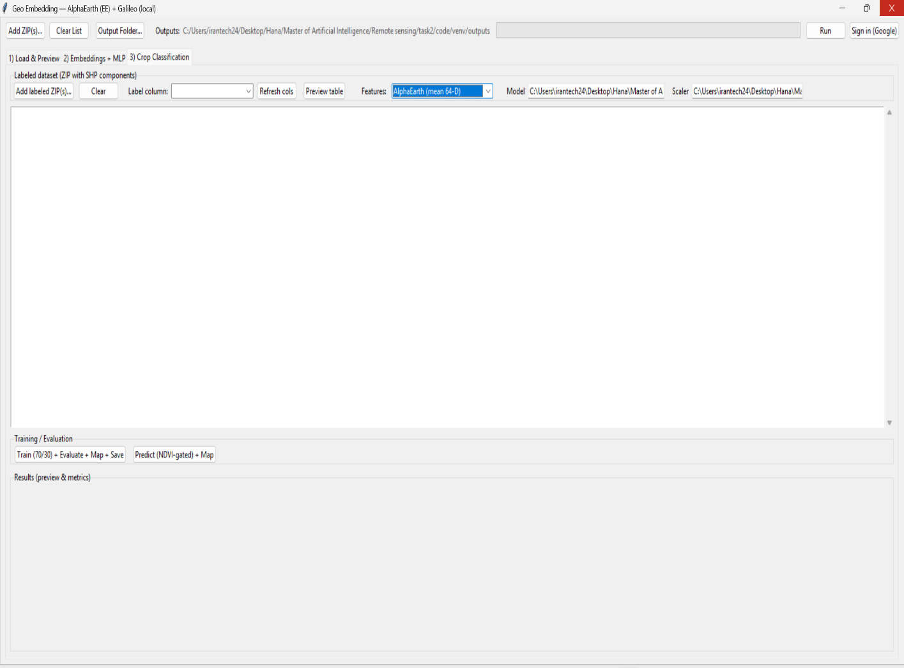
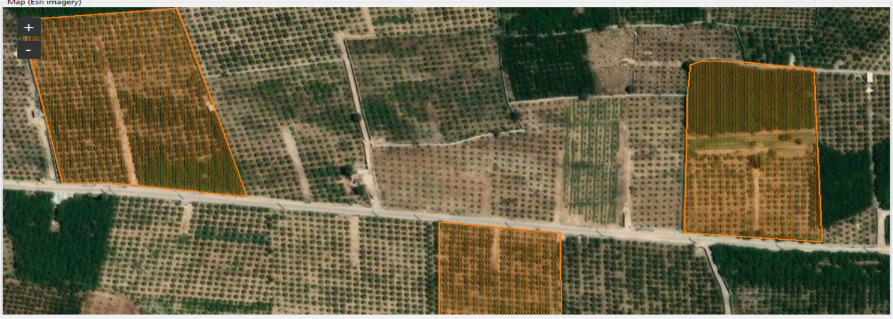
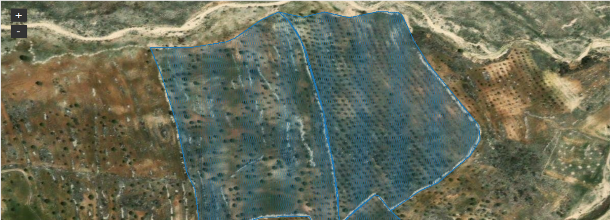
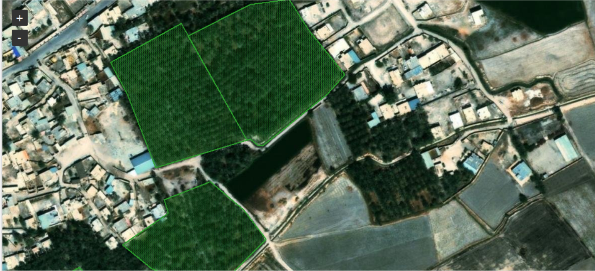

# GeoAI Crop Mapping Platform with Satellite Foundation Models

<p align="center">

<h2 align="center">
An End-to-End GeoAI Intelligence Platform for Agricultural Monitoring using Satellite Foundation Model Representations, AlphaEarth, Galileo, GIS Analytics, and Machine Learning
</h2>

</p>


<p align="center">

Remote Sensing • GeoAI • Earth Observation • Precision Agriculture • Satellite Foundation Models • GIS • Machine Learning

</p>


<p align="center">


</p>


---

# Overview


## GeoAI Agricultural Intelligence Platform


This repository presents an **applied GeoAI research and engineering platform** designed for agricultural monitoring and field-level crop mapping using satellite foundation model representations.


The framework integrates:

- Satellite foundation model embeddings
- Earth Observation analytics
- Google Earth Engine processing
- GIS-based polygon intelligence
- NDVI vegetation analysis
- Machine learning classification
- Automated agricultural map generation


The system transforms raw agricultural field boundaries into intelligent crop information products through an end-to-end computational pipeline.


The project was developed during:

**Fall 2025**

as an applied remote sensing intelligence system targeting real-world agricultural monitoring challenges.


---

# Project Motivation


Agricultural monitoring over large geographic regions remains challenging because of:


- High cost of field surveys
- Limited scalability of manual inspection
- Seasonal crop variations
- Complex satellite data interpretation


Satellite Earth Observation provides continuous and large-scale information about agricultural regions.


However, converting raw satellite observations into actionable agricultural intelligence requires:


- Powerful feature representations
- Automated geospatial processing
- Robust machine learning models


This project addresses these challenges by developing an automated satellite-based crop intelligence workflow.


---

# Research Problem


Given:


- Agricultural field polygons
- Satellite-derived representations
- Vegetation information


The objective is to learn discriminative representations for:


1. Vegetation status detection

2. Agricultural crop classification


The final goal is:


```

Satellite Observations

    ↓

Geospatial Intelligence

    ↓

Crop Information Products

```


---

# Key Contributions


## 1. End-to-End GeoAI Pipeline


A complete workflow from agricultural polygons to final GIS products:


```

Agricultural Field Polygons

        ↓

Geospatial Preprocessing

        ↓

Satellite Representation Extraction

        ↓

Vegetation Intelligence

        ↓

Crop Classification

        ↓

GIS Decision Support Outputs

```


---


# 2. Satellite Foundation Model Integration


The framework incorporates modern satellite representation learning approaches.


## AlphaEarth Satellite Embeddings


AlphaEarth representations are used to extract high-level satellite features capturing:


- Temporal characteristics
- Spectral patterns
- Earth observation information


Supported configurations:


| Feature Type | Dimension |
|---|---:|
| Mean Embedding | 64 |
| Statistical Representation | 256 |
| Combined Representation | 320 |


---


## Galileo Satellite Representation


The framework additionally supports Galileo-based satellite representations.


Available modes:


- Galileo-only features
- AlphaEarth + Galileo feature fusion


Feature fusion enables combining complementary satellite representations.


---

# 3. Polygon-Level Agricultural Intelligence


Unlike traditional pixel-based classification approaches,


this framework performs:


## Field-Level Intelligence


where each agricultural field polygon becomes an independent analysis unit.


Advantages:


- Preserves agricultural field boundaries
- Produces interpretable outputs
- Supports GIS-based decision making


---

# 4. Machine Learning Intelligence Layer


The platform contains two classification engines.


---

# Polygon-MLP


## Vegetation Intelligence Model


Objective:


Separate agricultural polygons into:


```

Vegetation

Non-Vegetation

Unknown

```


Input:


Satellite embeddings


Output:


Vegetation mask


---

# Crop-MLP


## Multi-Class Crop Classification Model


After vegetation filtering,


vegetation-positive polygons are processed by the crop classification engine.


Task:


Five-class crop classification


Input:


```

Satellite Representation Features

*

Agricultural Polygon Information

```


Output:


```

Crop Category Prediction

```


---

# System Architecture


```

```
                 User Interface Layer

                          |
                          |

              GeoAI Processing Engine
                          |
    ------------------------------------------------
    |                                              |
```
Geospatial Processing                         Machine Learning
```
    |                                              |
```
Polygon Validation                            Polygon-MLP

Geometry Filtering                            Crop-MLP

poly_id Generation                            Evaluation

```
    |
    |
```
Satellite Representation Layer
```
    |
    --------------------------------
    |                              |
```
AlphaEarth                      Galileo
```
    |
    |
```
Feature Engineering
```
    |
    |
```
NDVI Vegetation Analysis
```
    |
    |
```
GIS Crop Mapping Products

```


Detailed architecture:


```

docs/system_architecture.md

```


---

# Methodology


The proposed framework consists of five main stages.


---

# Stage 1 — Geospatial Data Engineering


Input:


Agricultural vector polygons


Processing:


- Geometry validation
- Area filtering
- Boundary simplification
- Coordinate normalization
- Unique polygon identifier generation


Output:


Clean agricultural field representation.


---

# Stage 2 — Satellite Representation Extraction


Satellite features are extracted using:


- AlphaEarth embeddings
- Galileo representations


These representations encode:


- Spectral information
- Temporal behavior
- Spatial characteristics


---

# Stage 3 — Vegetation Intelligence


Vegetation analysis is performed using:


NDVI-based vegetation indicators


Generated categories:


```

Vegetation

Non-Vegetation

Unknown

```


The generated labels are used for Polygon-MLP learning.


---

# Stage 4 — Crop Classification


Vegetation-positive polygons are processed by Crop-MLP.


Workflow:


```

Satellite Embeddings

    ↓

Feature Matrix Construction

    ↓

MLP Classification

    ↓

Crop Category Prediction

```


---

# Stage 5 — GIS Product Generation


The system generates:


- GeoJSON crop maps
- GeoPackage outputs
- Evaluation reports
- Visualization products


---

# Experimental Evaluation


## Dataset Availability


The experiments were performed on a private agricultural dataset.


Due to confidentiality restrictions:


The following data are not publicly released:


- Raw agricultural polygons
- Crop labels
- Satellite extracted features


The repository provides:


- Complete methodology
- Implementation framework
- Experimental design
- Evaluation strategy
- Visualization examples


---

# Experimental Setup


Classification evaluation was performed using:


## Data Split


```

Training Data : 70%

Testing Data  : 30%

```


using:


Stratified Shuffle Split


---

# Evaluation Metrics


The following metrics were used:


- Accuracy
- Precision
- Recall
- F1-score
- Macro F1-score


---

# Results


## Crop Classification Performance


| Metric | Score |
|---|---:|
| Accuracy | 94.00% |
| Macro F1-score | 94.05% |


The results demonstrate that satellite foundation model representations combined with machine learning classifiers can effectively support field-level crop mapping.


---

# Results Visualization


## System Workflow





---

## Application Interface


### Load & Preview Module


Capabilities:


- Agricultural polygon loading
- GIS visualization
- Geometry preprocessing configuration





---

# Embedding + MLP Module


Capabilities:


- AlphaEarth configuration
- Galileo integration
- Feature extraction
- Polygon-MLP training





---

# Crop Classification Module


Capabilities:


- Crop dataset loading
- Feature selection
- Crop-MLP training
- Evaluation
- Mapping





---

# Generated Agricultural Maps


Example outputs:











---

# Repository Structure


```

GeoAI-Crop-Mapping-Platform-with-Satellite-Foundation-Models

│
├── README.md
├── LICENSE
├── CITATION.cff
├── requirements.txt
│
├── docs/
│   │
│   ├── project_overview.md
│   ├── methodology.md
│   ├── system_architecture.md
│   ├── workflow.png
│   └── research_background.md
│
├── application/
│   └── geoai_crop_mapping_platform.py
│
├── data/
│   └── README.md
│
├── experiments/
│   ├── experiment_design.md
│   └── evaluation_protocol.md
│
└── results/
    ├── figures/
    └── metrics/


````


---

# Installation


## Clone Repository


```bash

git clone https://github.com/hannah-fathi/GeoAI-Crop-Mapping-Platform-with-Satellite-Foundation-Models.git

cd GeoAI-Crop-Mapping-Platform-with-Satellite-Foundation-Models

````

---

# Install Dependencies

```bash

pip install -r requirements.txt

```

---

# Running the Application

```bash

python application/geoai_crop_mapping_platform.py

```

The application provides:

* Polygon loading
* Satellite embedding extraction
* Machine learning training
* Crop prediction
* GIS visualization

---

# Reproducibility

The project follows a research-oriented workflow:

```

Data Preparation

        ↓

Feature Extraction

        ↓

Model Training

        ↓

Evaluation

        ↓

GIS Visualization

```

All experimental details are documented in:

```
docs/

experiments/

```

---

# Research Domains

This project contributes to:

* GeoAI
* Remote Sensing
* Earth Observation Foundation Models
* Precision Agriculture
* Machine Learning
* GIS Intelligence

---

# Future Research Directions

Potential extensions:

* Temporal satellite foundation models
* Self-supervised agricultural representation learning
* Deep learning crop segmentation
* Large-scale cloud deployment
* Multi-modal Earth Observation AI

---

# Author

## Hannah Fathi

M.Sc. Artificial Intelligence and Robotics

Fall 2025

Research Interests:

* Computer Vision
* Remote Sensing
* Medical AI
* Large Language Models
* GeoAI

---

# Citation

If you use this framework in research, please cite:

```bibtex
@software{fathi2025geoai_crop_mapping,

author = {Hannah Fathi},

title = {GeoAI Crop Mapping Platform with Satellite Foundation Models},

year = {2025},

description = {
An end-to-end GeoAI framework for agricultural monitoring
using satellite foundation model representations,
GIS analytics, and machine learning classification.
}

}

```

---

# License

MIT License
